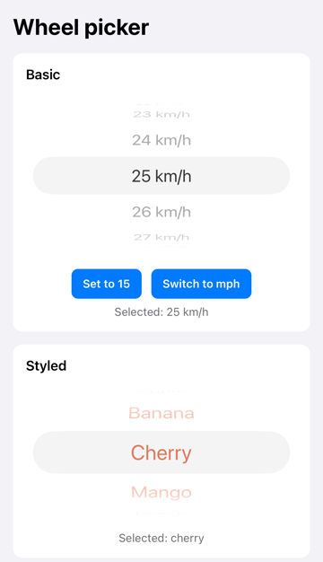
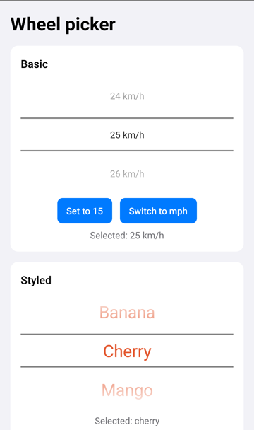

# @apolloscooters/react-native-wheel-picker-native

The real iOS and Android wheel picker for React Native, built so it never reloads under a touch.

- **Native**: `UIPickerView` on iOS and `NumberPicker` on Android, so it looks, scrolls and works with VoiceOver and TalkBack exactly like the platform's own wheel.
- **Stable**: the wheel on screen is never rebuilt while someone might be touching it. That is what made other wheel pickers crash on iOS (see [Why this exists](#why-this-exists)).
- **Simple**: one component, three props to get started, typed values.
- **New Architecture**: a Fabric component. No Expo modules or extra setup needed.

| iOS | Android |
| --- | --- |
|  |  |

## Installation

```sh
yarn add @apolloscooters/react-native-wheel-picker-native
```

or

```sh
npm install @apolloscooters/react-native-wheel-picker-native
```

Then install the iOS pod:

```sh
cd ios && pod install
```

Android needs nothing else: autolinking picks the package up on the next build.

### Expo

Works in [development builds](https://docs.expo.dev/develop/development-builds/introduction/) (`npx expo prebuild` or EAS Build). It does not work in Expo Go, which only ships the native code Expo bundles.

```sh
npx expo install @apolloscooters/react-native-wheel-picker-native
npx expo prebuild
```

### Requirements

| | Minimum |
| --- | --- |
| React Native | 0.80, with the New Architecture (the default since 0.76, the only option since 0.82) |
| iOS | The minimum your React Native version supports |
| Android | API 24. Text colour and font size need API 29 (Android 10); older versions use the system style |

## Usage

```tsx
import { useState } from 'react';
import { WheelPicker } from '@apolloscooters/react-native-wheel-picker-native';

const speeds = [10, 15, 20, 25, 30].map((speed) => ({
  label: `${speed} km/h`,
  value: speed,
}));

export function SpeedLimit() {
  const [speed, setSpeed] = useState(20);

  return (
    <WheelPicker
      items={speeds}
      selectedValue={speed}
      onValueChange={setSpeed}
      accessibilityLabel="Speed limit"
    />
  );
}
```

That is the whole API for most screens: give it rows, tell it which one is selected, and update your state when the user picks another.

### Strings work too

```tsx
const fruits = [
  { label: 'Apple', value: 'apple' },
  { label: 'Banana', value: 'banana' },
  { label: 'Cherry', value: 'cherry' },
];

<WheelPicker items={fruits} selectedValue={fruit} onValueChange={setFruit} />;
```

The value type is inferred from `items`, so `onValueChange` receives a `string` here and a `number` above.

### Choosing a value only when the user confirms

A common pattern is a dialog with Cancel and Save. Keep a draft value for the wheel and copy it when Save is pressed:

```tsx
const [saved, setSaved] = useState(20);
const [draft, setDraft] = useState(saved);

<WheelPicker items={speeds} selectedValue={draft} onValueChange={setDraft} />
<Button title="Save" onPress={() => setSaved(draft)} />
```

### Styling

```tsx
<WheelPicker
  items={fruits}
  selectedValue={fruit}
  onValueChange={setFruit}
  textColor="#E4572E"
  fontSize={26}
  style={{ height: 180, width: 240 }}
/>
```

The wheel is 216 points tall on iOS and 180 on Android unless you set a height. It fills the width it is given.

For dark mode, pass the colour your theme uses for text, for example `textColor={isDark ? '#FFFFFF' : '#000000'}`. When no colour is set, iOS uses the system label colour, which already follows dark mode.

## Props

| Prop | Type | Default | Description |
| --- | --- | --- | --- |
| `items` | `{ label: string; value: string \| number }[]` | required | The rows, top to bottom. Values should be unique. |
| `selectedValue` | `string \| number` | first row | The value of the row to show. If no item has this value, the first row is shown. |
| `onValueChange` | `(value, index) => void` | | Called when the wheel comes to rest on a row the user scrolled or tapped to. |
| `textColor` | `ColorValue` | platform label colour | Colour of the row text. |
| `fontSize` | `number` | platform size | Font size of the row text, in points. On iOS the default follows the user's text size setting. |
| `accessibilityLabel` | `string` | | The name VoiceOver and TalkBack read for the wheel, for example "Speed limit". |
| `style` | `StyleProp<ViewStyle>` | `{ height: 216 }` on iOS, `{ height: 180 }` on Android | Size and layout. |
| `testID` | `string` | | For end to end tests. |

The package also exports the `WheelPickerItem`, `WheelPickerProps` and `WheelPickerValue` types.

## How it behaves

- **`onValueChange` fires when the wheel stops**, not for every row it passes while spinning. It does not fire when you change `selectedValue` yourself.
- **Changing `selectedValue` moves the wheel** without an animation. If the user is touching or spinning the wheel at that moment, the change waits until the next update after the wheel has stopped, so it never fights the user's finger.
- **Changing `items`, `textColor` or `fontSize` replaces the wheel** with a freshly built one showing `selectedValue`. You can change them at any time, for example to switch units from km/h to mph, but avoid changing them on every render: create `items` with `useMemo` or outside the component.
- **Empty `items`** shows an empty wheel and never calls `onValueChange`.

## Accessibility

The wheel is the platform control, so screen readers handle it the way users expect:

- **VoiceOver (iOS)** announces the `accessibilityLabel`, the current row and that it is adjustable. Swiping up or down moves one row.
- **TalkBack (Android)** reads the current row and lets the user move through the rows.

Always pass an `accessibilityLabel` that says what the wheel chooses. Without it, a screen reader user only hears a value.

## Why this exists

The iOS wheel from `@react-native-picker/picker` can crash under Fabric with `EXC_BAD_ACCESS` in `-[UIPickerView hitTest:withEvent:]`, on table cells that were already released ([react-native-picker/picker#627](https://github.com/react-native-picker/picker/issues/627)). It happens when a touch arrives while the wheel's rows are being rebuilt, for example when the user taps a wheel that is still spinning.

We hit it in production in the [Apollo Scooters](https://apolloscooters.co) app and found several ways the wheel could be rebuilt under a finger:

1. Every prop update, including the one sent for each row the wheel passes, reloaded the wheel.
2. React Native recycled the native view between screens, because the library's recycling opt out was declared in a way React Native never reads.
3. The selection was set from code with an animation while the user could still be touching it.

This package is built around one rule: **a wheel that is on screen is never rebuilt**. In practice:

- each wheel loads its rows once,
- a change of rows, colour or font swaps in a new wheel instead of reloading the old one,
- the selection only moves from code when nobody is touching the wheel,
- the native view is never recycled.

The same design ships in the Apollo Scooters app, where an automated stress test ran it hundreds of times in a row on a real iPhone and on the simulator without a crash: open the wheel in a dialog, flick it twice, tap it while it is still coasting, close with Save or Cancel, repeat. This package runs the same test against its example app.

## Migrating from `@react-native-picker/picker`

```tsx
// Before
<Picker selectedValue={speed} onValueChange={setSpeed}>
  {speeds.map((s) => (
    <Picker.Item key={s.value} label={s.label} value={s.value} />
  ))}
</Picker>

// After
<WheelPicker items={speeds} selectedValue={speed} onValueChange={setSpeed} />
```

Differences to know about:

- Rows are an `items` array rather than child elements.
- On Android this package always shows a wheel. `@react-native-picker/picker` shows a dropdown or dialog there.
- `itemStyle` becomes `textColor` and `fontSize`.
- `onValueChange` fires once the wheel stops, not while it scrolls.

## Troubleshooting

**"Unimplemented component" or nothing renders.** The New Architecture is off, which is only possible on React Native 0.80 and 0.81. Turn it back on (`newArchEnabled=true` in `android/gradle.properties`, and `RCT_NEW_ARCH_ENABLED=1 pod install` for iOS), then rebuild the app.

**"WheelPickerNativeView" was not found in the UIManager.** The native code is not in your build. Run `pod install` for iOS, then rebuild the app. Reloading JavaScript is not enough after adding a native package.

**It does not work in Expo Go.** That is expected, see [Expo](#expo).

**Android ignores `textColor` or `fontSize`.** The device runs Android 9 or older, where `NumberPicker` does not offer these settings. The wheel uses the system style there.

## Example app

The [`example`](example) folder has a small app with a basic wheel, programmatic changes, a unit switch, styling and a wheel inside a modal.

```sh
yarn
yarn example ios       # or: yarn example android
```

## Contributing

Bug reports and pull requests are welcome. See [CONTRIBUTING.md](CONTRIBUTING.md) for how to set up the project and run the checks.

## License

MIT, see [LICENSE](LICENSE).

Made by [Apollo Scooters](https://apolloscooters.co).
